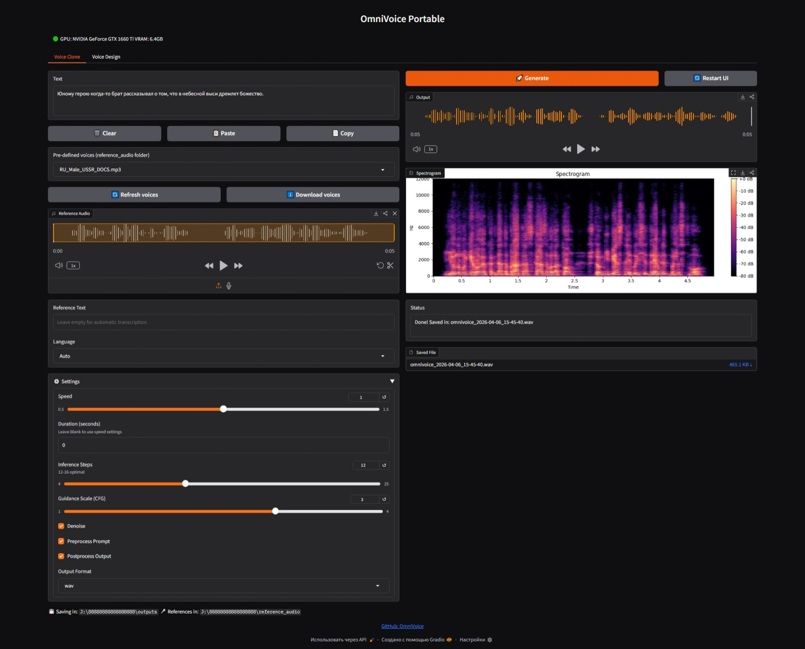

# 🚀 OmniVoice: Towards Omnilingual Zero-Shot Text-to-Speech with Diffusion Language Models

## 🔧 About
OmniVoice is a state-of-the-art massive multilingual zero-shot text-to-speech (TTS) model supporting over 600 languages. Built on a novel diffusion language model-style architecture, it generates high-quality speech with superior inference speed, supporting voice cloning and voice design.

## 🔧 Key Features

- **600+ Languages Supported**: The broadest language coverage among zero-shot TTS models ([full list](docs/languages.md)).
- **Voice Cloning**: State-of-the-art voice cloning quality.
- **Voice Design**: Control voices via assigned speaker attributes (gender, age, pitch, dialect/accent, whisper, etc.).
- **Fine-grained Control**: Non-verbal symbols (e.g., `[laughter]`) and pronunciation correction via pinyin or phonemes.
- **Fast Inference**: RTF as low as 0.025 (40x faster than real-time).
- **Diffusion Language Model-Style Architecture**: A clean, streamlined, and scalable design that delivers both quality and speed.

## 🔧 Key Differences from Official OmniVoice
- Main `.bat` menu with option to install/reinstall project
- Fully portable with offline OmniVoice and Whisper models
- Rewriten code for beter work

## ⚙️ Installation
OmniVoice uses Python 3.11 and Torch 2.8.0 Cuda 12.8.

OmniVoice supports GTX and RTX cards, including GTX16xx and RTX 20xx–50xx, even with 4-6Gb VRAM (with auto offload mode).

### 🖥️ Windows Installation

This project provided with only *.bat installer/re-installer/starter/updater file, that will download and install all components and build fully portable OmniVoice.

➤ Please Note:
    - I'm supporting only nVidia GTX16xx and RTX20xx-50xx GPUs.
    - This installer is intended for those running Windows 10 or higher. 
    - Application functionality for systems running Windows 7 or lower is not guaranteed.

- Download the OmniVoice .bat installer for Windows in [Releases](https://github.com/LeeAeron/OmniVoice/releases).
- Place the BAT-file in any folder in the root of any partition with a short Latin name without spaces or special characters and run it.
- Select INSTALL (2) entry .bat file will download, unpack and configure all needed environment.
- After installing, select START (1). .bat will launch Browser, and loads necessary files, models, also there will be loaded official OmniVoice and Whisper models for offload usage.

## ⚙️ New Features:
- downloadable optional voice pack (838 voices)
- support for change output file format: wav/mp3/aac/m4a/m4b/ogg/flac/opus changeable audio files (with own local FFMPEG in OmniVoice folder)
- auto-saving synthezed output file into local 'outputs' folder (in project folder)
- additional Copy/Paste/Clear buttons for 'Text to synteze' (works with clipboard)

## 📺 Credits

* [LeeAeron](https://github.com/LeeAeron) — additional code, modding, reworking, repository, Hugginface space, features, installer/launcher, reference audios.
* [k2-fsa](https://github.com/k2-fsa) - native code, voice model

## 📝 License

The **OmniVoice** code is released under Apache License. 
